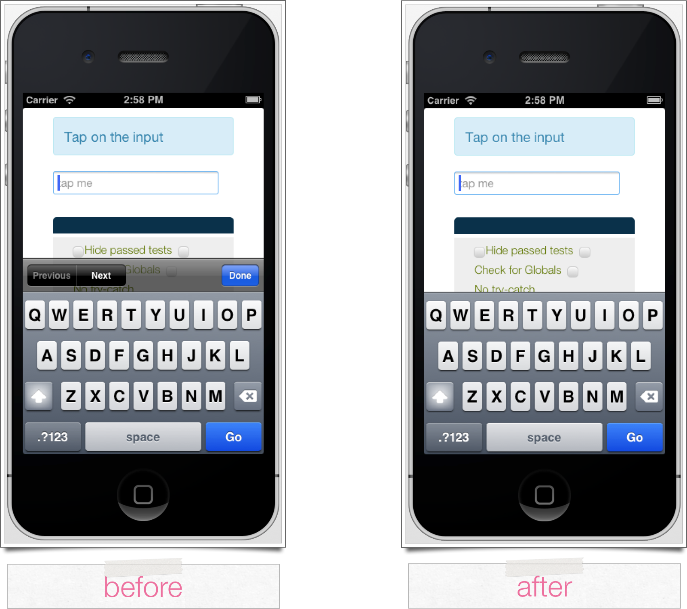

Removing the iOS form assist bar
========================================

A native Trigger.IO plugin that yanks the nasty form assistant from Mobile Safari web views.

From JavaScript:

	forge.internal.call("damn_you_form_assist.killBar", {
	  text: ""
	}, (function() {
	  return alert("Success!");
	}), function(e) {
	  return alert("Error: " + e.message);
	});

From CoffeeScript:

	forge.internal.call 'damn_you_form_assist.killBar',
	  text: ''
	  , (->
	    alert 'Success!'
	  ), (e) ->
	    alert 'Error: ' + e.message

It's recommended you use this API after `focus()` has fired on an input.

